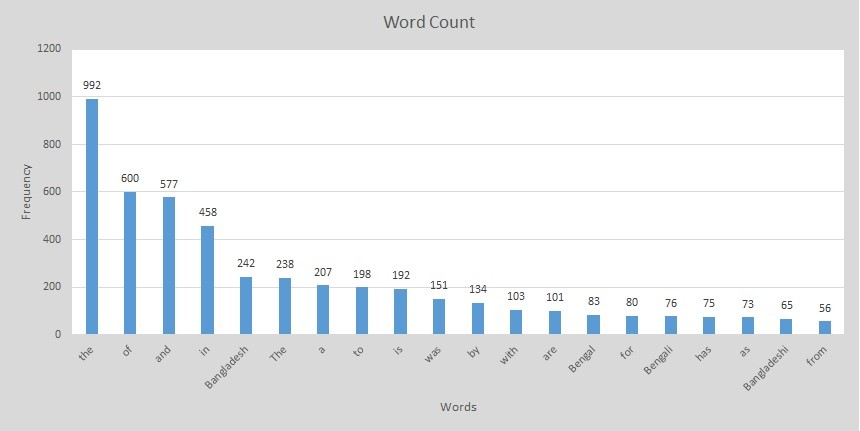

# GomesSparkWordCount


## Links

- [Source](https://github.com/paulgms/GomesSparkWordCount "Source code repo")
- [Webpage](https://paulgms.github.io/GomesSparkWordCount/ "Spark word count webpage")

## Me & Objective of the project 
I am Anik Paul Gomes. I am from Bangladesh and currently attending Northwest Missouri State University. 

The objective of this project is to use spark to count the words in a text document. For this project, I have counted words of a wikipedia page about Bangaldesh. 

## Data 
My data source is a wikipedia page about Bangladesh.
- [Data source](https://en.wikipedia.org/wiki/Bangladesh "Bangladesh-Wikipedia")

## Scala commands

```
> val inputFile = sc.textFile("C:/44517/ConardSparkWordCount/AMSND.txt")
> val topWordCount = inputFile.
  flatMap(str=>str.split(" ")).
  filter(!_.isEmpty).
  map(word=>(word,1)).
  reduceByKey(_+_).
  map{case (word, count) => (count, word)}.
  sortByKey(false)
>topWordCount.take(10).foreach(x=>println(x))
```

## Results

| Frequency | Word        |
|-----------|-------------|
| 992       | the         |
| 600       | of          |
| 577       | and         |
| 458       | in          |
| 242       | Bangladesh  |
| 238       | The         |
| 207       | a           |
| 198       | to          |
| 192       | is          |
| 151       | was         |
| 134       | by          |
| 103       | with        |
| 101       | are         |
| 83        | Bengal      |
| 80        | for         |
| 76        | Bengali     |
| 75        | has         |
| 73        | as          |
| 65        | Bangladeshi |
| 56        | from        |


The most frequest word is "the". I was expecting it to be Bangladesh. However, it's 5th in the list. My findings agree with my assumptions. Bangladesh - 242 times, Bengal - 83 times, Bengali - 76,  Bangladeshi - 65 times, are in my list (first 20).  

## Visual representation of the result



